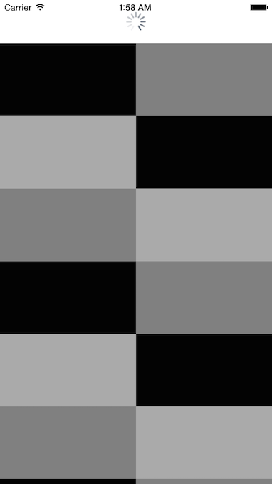

# PullToRefresh

Use `UIRefreshControl` on UICollectionViewController.



## Features
- [x] Support to pull to refresh
- [x] Support to load request after scrolling bottom
- [x] Create UITableViewController about `loadRequestControl`
- [x] Support Cocoapods
- [x] Support to request without UIRefreshControl()

## Usage

- refreshControl

refreshControl start animation and callback method:
```
func willRefresh()
```

If data that controller has refresh, controller call method:
```
refreshControl.endRefreshing()
```

- loadRequestControl

scrolling to bottom and callback method:
```
func willLoadRequest()
```

After load request, controller call method:
```
loadRequestControl.endRefreshing()
```
